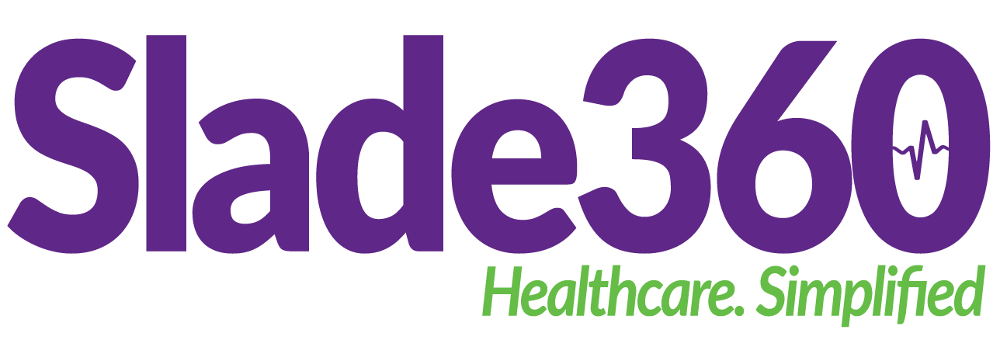

<a name="readme-top"></a>

<div align="center">

  
  <br/>

  <h3><b>Slade360Advantage-Frontend</b></h3>

</div>

<!-- TABLE OF CONTENTS -->

# 📗 Table of Contents

- [📖 About the Project](#about-project)
  - [🛠 Built With](#built-with)
    - [Tech Stack](#tech-stack)
  - [🚀 Live Demo](#live-demo)
- [💻 Getting Started](#getting-started)
  - [Prerequisites](#prerequisites)
  - [Setup](#setup)
  - [Install](#install)
  - [Usage](#usage)
  - [Run tests](#run-tests-and-linters)
<!-- PROJECT DESCRIPTION -->

# 📖 Slade360Advantage-Frontend <a id="about-project"></a>

**Slade 360 Advantage** is a web application built with Angular v20, designed to streamline healthcare provider workflows in hospitals, clinics, and other medical facilities. It enhances the patient experience by managing the entire journey from check-in to post-visit engagement.

## 🛠 Built With <a id="built-with"></a>

### Tech Stack <a id="tech-stack"></a>

<details>
  <summary>Client</summary>
  <ul>
    <li><a href="https://angular.io/">Angular 20</a></li>
  </ul>
</details>

<!-- LIVE DEMO -->

## 🚀 Live Demo <a id="live-demo"></a>

- [Live Demo Link](https://uat-emr.advantage.slade360.com/)

<p align="right">(<a href="#readme-top">back to top</a>)</p>

<!-- GETTING STARTED -->

### 💻 Getting Started <a id="getting-started"></a>

To get a local copy up and running, follow these steps below. This assumes your team lead has given you access to the repository.

### Prerequisites

It is recommended to run the application in a linux environment.
In order to run this project you need to install the following dependencies.
You can use the apt package manager.

- Refresh your local package index first before installing any new dependency.

```sh
sudo apt update
```

### Install NodeJs

```sh
sudo apt install nodejs
```

### Setup nvm

```
wget -qO- https://raw.githubusercontent.com/creationix/nvm/v0.34.0/install.sh
export NVM_DIR="$HOME/.nvm" && . "$NVM_DIR/nvm.sh" --no-use
nvm install 20.12.2
```

- Run `nvm ls` to see what version of nodejs you are running before proceeding.

  If you are not on `20.12.2`, run `nvm use 20.12.2`

### To run npm packages locally

```
export PATH="$(npm bin):$PATH"
```

### Viewing code documentation

```
npm run docs:serve
```

This will serve the documentation on your localhost: <http://localhost:9021/>

### Running code documentation coverage

```
npm run docs:coverage
```

### Setting up husky for git hooks

```
    npx husky install
```

### Install Angular

```sh
    sudo apt update
    npm install -g @angular/cli
```

### Download, Install and Configure Git

- Open a terminal and run:

  ```
  sudo apt update
  sudo apt install git
  ```

  After installation, set up your name and email (used for commits):

  ```
  git config --global user.name "Your Name"
  git config --global user.email "your-email@example.com"

  ```

### Setup

In your local linux environement set up ssh
Step 1: Generate an SSH Key Pair, Open the terminal and run

```
ssh-keygen -t rsa -b 4096 -C "your-email@example.com"
```

Step 2: Choose a save location

The default path is ~/.ssh/id_rsa. Press Enter to accept or provide a custom path.

step 3: Manually copy the ssh key. Copy the contents from the output below

```
cat ~/.ssh/id_rsa.pub

```

step 4: Visit your GitHub account. Click the profile icon, then click preferences. Navigate to ssh keys and paste the contents you copied from step 3.

Clone this repository to your desired folder:

```sh
  cd my-folder
  git clone git@github.com:savannahghi/empower-frontend.git
```

### Install

Install this project with:

```sh
  cd my-folder/advantage-frontend
  npm install
```

### Usage

First set up the environment variables. In the project root, create a folder env and a file test.sh. The contents for this file will be provided.
Once the file(test.sh) is shared, run the following command

```
    source env/test.sh
```

The above command is used to execute a script within the current shell environment. This command runs the script in the same shell session rather than spawning a new shell, which means any changes made to the environment (such as setting environment variables) will persist in the current session.

To run the project, execute the following command:

```sh
  npm run start-client
```

### Run tests and linters

To run tests, run the following command:

```sh
  npm run test
```

### Lint the project

This can be after installing the packages and running `export PATH="$(npm bin):$PATH"`

#### Lint code

```
npm run lint
```

#### Lint sass/css

```
npm run lint:styles
```

### Running unit tests

```
npm test
```

### Runnint e2e tests

```
export PATH="$(npm bin):$PATH"
npx cucumber-js
```

### Before pushing you code

Run the following command:

```
npm run prepush
```

<p align="right">(<a href="#readme-top">back to top</a>)</p>
